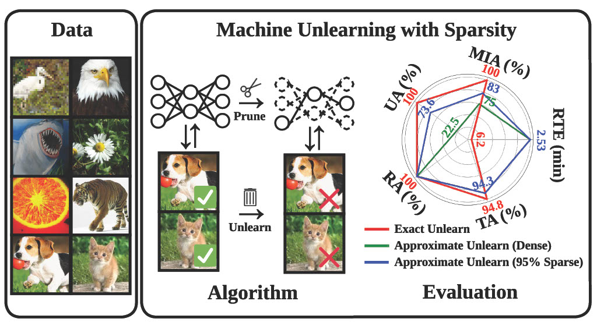

<div align="center">

# Model Sparsity Can Simplify Machine Unlearning

[](https://arxiv.org/abs/2304.04934)
[](https://opensource.org/licenses/MIT)
[](https://nips.cc/)

</div>
<table align="center">
  <tr>
    <td align="center"> 
       
      <br>
      <em style="font-size: 18px;">  <strong style="font-size: 18px;">Figure 1:</strong> Schematic overview of our proposal on model sparsity driven MU.</em>
    </td>
  </tr>
</table>

This is the official code repository for the NeurIPS 2023 Spotlight paper [Model Sparsity Can Simplify Machine Unlearning](https://arxiv.org/abs/2304.04934).
# Abstract
In response to recent data regulation requirements, machine unlearning (MU) has emerged as a critical process to remove the influence of specific examples from a given model. Although exact unlearning can be achieved through complete model retraining using the remaining dataset, the associated computational costs have driven the development of efficient, approximate unlearning techniques. Moving beyond data-centric MU approaches, our study introduces a novel model-based perspective: model sparsification via weight pruning, which is capable of reducing the gap between exact unlearning and approximate unlearning. We show in both theory and practice that model sparsity can boost the multi-criteria unlearning performance of an approximate unlearner, closing the approximation gap, while continuing to be efficient. This leads to a new MU paradigm, termed prune first, then unlearn, which infuses a sparse model prior into the unlearning process. Building on this insight, we also develop a sparsity-aware unlearning method that utilizes sparsity regularization to enhance the training process of approximate unlearning. Extensive experiments show that our proposals consistently benefit MU in various unlearning scenarios. A notable highlight is the 77% unlearning efficacy gain of fine-tuning (one of the simplest unlearning methods) when using sparsity-aware unlearning. Furthermore, we demonstrate the practical impact of our proposed MU methods in addressing other machine learning challenges, such as defending against backdoor attacks and enhancing transfer learning.
# Requirements
```
conda env create -f environment.yml
```

# Code Structure
The source code is organized as follows:

```evaluation```: contains MIA evaluation code.

```models```: contains the model definitions.

```utils.py```: contains the utility functions. 

```main_imp.py```: contains the code for training and pruning. 

```main_forget.py```: contains the main executable code for unlearning. 

```main_backdoor.py```: contains the main executable code for backdoor cleanse.
# Commands

## Pruning

### OMP

```python -u main_imp.py --data ./data --dataset $data --arch $arch --prune_type rewind_lt --rewind_epoch 8 --save_dir ${save_dir} --rate ${rate} --pruning_times 2 --num_workers 8```

### IMP

```python -u main_imp.py --data ./data --dataset $data --arch $arch --prune_type rewind_lt --rewind_epoch 8 --save_dir ${save_dir} --rate 0.2 --pruning_times ${pruning_times} --num_workers 8```

### SynFlow

```python -u main_synflow.py --data ./data --dataset cifar10 --prune_type rewind_lt --rewind_epoch 8 --save_dir ${save_dir} --rate ${rate} --pruning_times 1 --num_workers 8```

## Unlearning

### Retrain

```python -u main_forget.py --save_dir ${save_dir} --mask ${mask_path} --unlearn retrain --num_indexes_to_replace 4500 --unlearn_epochs 160 --unlearn_lr 0.1```

### FT

```python -u main_forget.py --save_dir ${save_dir} --mask ${mask_path} --unlearn FT --num_indexes_to_replace 4500 --unlearn_lr 0.01 --unlearn_epochs 10```

### GA

```python -u main_forget.py --save_dir ${save_dir} --mask ${mask_path} --unlearn GA --num_indexes_to_replace 4500 --unlearn_lr 0.0001 --unlearn_epochs 5```

### FF

```python -u main_forget.py --save_dir ${save_dir} --mask ${mask_path} --unlearn fisher_new --num_indexes_to_replace 4500 --alpha ${alpha}```

### IU

```python -u main_forget.py --save_dir ${save_dir} --mask ${mask_path} --unlearn wfisher --num_indexes_to_replace 4500 --alpha ${alpha}```

### $\ell_1$-sparse

```python -u main_forget.py --save_dir ${save_dir} --mask ${mask_path} --unlearn FT_prune --num_indexes_to_replace 4500 --alpha ${alpha} --unlearn_lr 0.01 --unlearn_epochs 10```

## Trojan model cleanse

```python -u main_backdoor.py --save_dir ${save_dir} --mask ${mask_path} --unlearn FT --num_indexes_to_replace 4500```

# BibTeX
If you find this repository or the ideas presented in our paper useful, please consider citing.
```
@article{jia2023model,
  title={Model sparsification can simplify machine unlearning},
  author={Jia, Jinghan and Liu, Jiancheng and Ram, Parikshit and Yao, Yuguang and Liu, Gaowen and Liu, Yang and Sharma, Pranay and Liu, Sijia},
  journal={arXiv preprint arXiv:2304.04934},
  year={2023}
}
```
