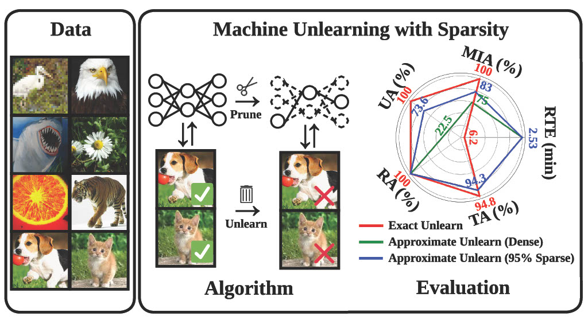

<div align="center">

# Model Sparsity Can Simplify Machine Unlearning

[](https://arxiv.org/abs/2304.04934)
[](https://opensource.org/licenses/MIT)
[-007CFF)](https://nips.cc/Conferences/2023)

[](https://github.com/OPTML-Group/Unlearn-Sparse)
[](https://github.com/OPTML-Group/Unlearn-Sparse)
[](https://github.com/OPTML-Group/Unlearn-Sparse)

</div>
<table align="center">
  <tr>
    <td align="center"> 
       
      <br>
      <em style="font-size: 18px;">  <strong style="font-size: 18px;">Figure 1:</strong> Schematic overview of our proposal on model sparsity driven MU.</em>
    </td>
  </tr>
</table>

This is the official code repository for the NeurIPS 2023 Spotlight paper [Model Sparsity Can Simplify Machine Unlearning](https://arxiv.org/abs/2304.04934).
## Abstract
In response to recent data regulation requirements, machine unlearning (MU) has emerged as a critical process to remove the influence of specific examples from a given model. Although exact unlearning can be achieved through complete model retraining using the remaining dataset, the associated computational costs have driven the development of efficient, approximate unlearning techniques. Moving beyond data-centric MU approaches, our study introduces a novel model-based perspective: model sparsification via weight pruning, which is capable of reducing the gap between exact unlearning and approximate unlearning. We show in both theory and practice that model sparsity can boost the multi-criteria unlearning performance of an approximate unlearner, closing the approximation gap, while continuing to be efficient. This leads to a new MU paradigm, termed prune first, then unlearn, which infuses a sparse model prior into the unlearning process. Building on this insight, we also develop a sparsity-aware unlearning method that utilizes sparsity regularization to enhance the training process of approximate unlearning. Extensive experiments show that our proposals consistently benefit MU in various unlearning scenarios. A notable highlight is the 77% unlearning efficacy gain of fine-tuning (one of the simplest unlearning methods) when using sparsity-aware unlearning. Furthermore, we demonstrate the practical impact of our proposed MU methods in addressing other machine learning challenges, such as defending against backdoor attacks and enhancing transfer learning.
## Requirements
```
conda env create -f environment.yml
```

## Code Structure
The source code is organized as follows:

```main.py```: unified CLI entrypoint. Dispatches to:
- ```prune``` -> ```pruning_pipeline.py```
- ```unlearn``` -> ```forget_pipeline.py```
- ```backdoor``` -> ```backdoor_pipeline.py```

```arg_parser.py```: shared argument definitions used by all workflows.

```pruning_pipeline.py```: training + pruning implementations (IMP/LS/SAM/ViT profiles and SynFlow).

```forget_pipeline.py```: unlearning pipeline. Loads sparse masks, runs unlearn methods, and executes accuracy/MIA evaluations.

```backdoor_pipeline.py```: backdoor cleansing pipeline. Builds poisoned data loaders and applies unlearning to mitigate attack behavior.

```unlearn/```: unlearning method implementations (e.g., ```retrain```, ```FT```, ```GA```, and variants).

```pruner/```: pruning utilities and methods (mask extraction/application, OMP-style pruning, SynFlow-related logic).

```trainer/```: train/validate loops, including standard SGD loop and SAM training loop.

```evaluation/```: MIA evaluation code (including SVC-based MIA metrics).

```models/```: model definitions.

```dataset.py```: dataset loading/splitting and forget-sample marking utilities.

```utils.py```: utility functions for setup, checkpointing, data conversion, and helper routines.

## Quick Start

1. Run ```prune``` first to produce a sparse checkpoint.
2. Run ```unlearn``` with that checkpoint (via ```--mask```) to remove target-data influence.
3. Check accuracy + MIA results, and optionally run ```backdoor``` for security-focused evaluation.

## Commands

### 0) Set common variables

```bash
DATA=./data
DATASET=cifar10
ARCH=resnet18
SAVE_DIR=./runs/${DATASET}_${ARCH}
MASK_PATH=${SAVE_DIR}/0model_SA_best.pth.tar
```

### 1) Train + prune (single entry: `prune`)

```bash
# OMP
python -u main.py prune --profile imp \
  --data ${DATA} --dataset ${DATASET} --arch ${ARCH} \
  --save_dir ${SAVE_DIR} --prune_type rewind_lt --rewind_epoch 8 \
  --rate 0.95 --pruning_times 1 --workers 8

# IMP
python -u main.py prune --profile imp \
  --data ${DATA} --dataset ${DATASET} --arch ${ARCH} \
  --save_dir ${SAVE_DIR} --prune_type rewind_lt --rewind_epoch 8 \
  --rate 0.2 --pruning_times 5 --workers 8

# SynFlow
python -u main.py prune --profile synflow \
  --data ${DATA} --dataset ${DATASET} --arch ${ARCH} \
  --save_dir ${SAVE_DIR}_synflow --prune_type rewind_lt --rewind_epoch 8 \
  --rate 0.95 --pruning_times 1 --workers 8
```
This command trains a model and then prunes it into a sparse structure, which is the paper's "prune first" step for creating a sparse prior before unlearning; ```pruning_times``` controls whether pruning is one-shot or iterative, and the key output is a sparse checkpoint (for example ```0model_SA_best.pth.tar```) for the next stage.

Optional pruning profiles:

```bash
python -u main.py prune --profile ls  --data ${DATA} --dataset ${DATASET} --arch ${ARCH} --save_dir ${SAVE_DIR}_ls
python -u main.py prune --profile sam --data ${DATA} --dataset ${DATASET} --arch ${ARCH} --save_dir ${SAVE_DIR}_sam
python -u main.py prune --profile vit --data ${DATA} --dataset ${DATASET} --arch ${ARCH} --save_dir ${SAVE_DIR}_vit
```

### 2) Unlearning (single entry: `unlearn`)

Forget-setting flags:

Use ```--num_indexes_to_replace``` to set how many samples to forget, ```--class_to_replace``` to choose the source class (default ```0```), and ```--mask``` to pass the sparse checkpoint from pruning.

```bash
# Retrain
python -u main.py unlearn --save_dir ${SAVE_DIR} --mask ${MASK_PATH} \
  --dataset ${DATASET} --arch ${ARCH} --unlearn retrain \
  --num_indexes_to_replace 4500 --unlearn_epochs 160 --unlearn_lr 0.1

# FT
python -u main.py unlearn --save_dir ${SAVE_DIR} --mask ${MASK_PATH} \
  --dataset ${DATASET} --arch ${ARCH} --unlearn FT \
  --num_indexes_to_replace 4500 --unlearn_epochs 10 --unlearn_lr 0.01

# GA
python -u main.py unlearn --save_dir ${SAVE_DIR} --mask ${MASK_PATH} \
  --dataset ${DATASET} --arch ${ARCH} --unlearn GA \
  --num_indexes_to_replace 4500 --unlearn_epochs 5 --unlearn_lr 0.0001

# FF (fisher_new)
python -u main.py unlearn --save_dir ${SAVE_DIR} --mask ${MASK_PATH} \
  --dataset ${DATASET} --arch ${ARCH} --unlearn fisher_new \
  --num_indexes_to_replace 4500 --alpha 0.2

# IU (wfisher)
python -u main.py unlearn --save_dir ${SAVE_DIR} --mask ${MASK_PATH} \
  --dataset ${DATASET} --arch ${ARCH} --unlearn wfisher \
  --num_indexes_to_replace 4500 --alpha 0.2

# l1-sparse (FT_prune)
python -u main.py unlearn --save_dir ${SAVE_DIR} --mask ${MASK_PATH} \
  --dataset ${DATASET} --arch ${ARCH} --unlearn FT_prune \
  --num_indexes_to_replace 4500 --alpha 0.2 --unlearn_lr 0.01 --unlearn_epochs 10
```

ImageNet unlearning:

```bash
python -u main.py unlearn \
  --dataset imagenet --arch resnet18 --imagenet_arch \
  --save_dir ./runs/imagenet_resnet18 \
  --mask ./runs/imagenet_resnet18/0model_SA_best.pth.tar \
  --class_to_replace 0 --unlearn FT --unlearn_epochs 5 --unlearn_lr 0.001
```
This command removes the influence of a target class or selected samples from a trained model and runs on top of the sparse model from ```prune``` (via ```--mask```), which is the central idea in this work; different ```--unlearn``` choices trade off quality and speed (for example, ```retrain``` is strongest but slowest, ```FT``` is a fast fine-tuning baseline, and ```GA``` actively pushes the model away from forgotten data), and the outputs include both utility and privacy-style signals such as accuracy and MIA.

Available ```--unlearn``` methods (algorithm-level):

- ```retrain```: retrains on retain data only, approximating full retraining without forgotten data.
- ```FT```: fine-tunes the model on retain data for a small number of epochs (efficient baseline).
- ```GA```: performs gradient ascent on forget data (negative CE) to actively unfit forgotten samples.
- ```fisher_new``` (FF): uses a Hessian/Fisher-style curvature estimate and samples new weights from a noise model.
- ```wfisher``` (IU): computes a WoodFisher-style second-order perturbation using retain/forget gradients, then updates parameters once.
- ```FT_prune``` (```l1```-sparse): applies sparsity-aware fine-tuning with L1 regularization as an unlearning strategy.

### 3) Backdoor cleanse (single entry: `backdoor`)

```bash
python -u main.py backdoor \
  --save_dir ${SAVE_DIR}_backdoor \
  --mask ${SAVE_DIR}_backdoor/mask.pt \
  --dataset ${DATASET} --arch ${ARCH} \
  --unlearn FT --num_indexes_to_replace 4500 --class_to_replace 0
```
This command evaluates unlearning in a security setting by first simulating poisoned trigger behavior and then applying unlearning to clean it, with the key readout being whether attack success drops while clean accuracy remains usable.

### 4) Resume interrupted runs

```bash
# resume pruning
python -u main.py prune --profile imp --resume --checkpoint ${SAVE_DIR}/0checkpoint.pth.tar --save_dir ${SAVE_DIR}

# resume unlearning
python -u main.py unlearn --resume --save_dir ${SAVE_DIR} --mask ${MASK_PATH} --unlearn FT
```
This command resumes interrupted long-running experiments, which is useful for reproducibility and large sweeps where pruning or unlearning may take many hours.

## BibTeX
If you find this repository or the ideas presented in our paper useful, please consider citing.
```
@inproceedings{jia2023model,
  title={Model Sparsity Can Simplify Machine Unlearning},
  author={Jia, Jinghan and Liu, Jiancheng and Ram, Parikshit and Yao, Yuguang and Liu, Gaowen and Liu, Yang and Sharma, Pranay and Liu, Sijia},
  booktitle={Thirty-seventh Conference on Neural Information Processing Systems},
  year={2023}
}
```
